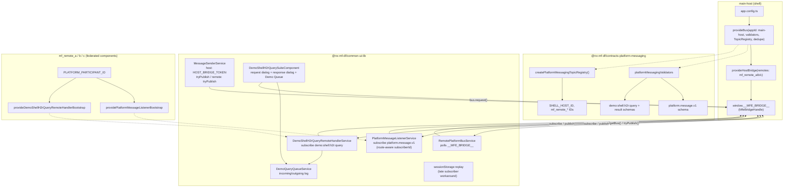

# monorepo-nx-mf-dyn-modfed

Angular 21 + Nx monorepo proof-of-concept for **native module federation** with **host-mediated cross-microfrontend messaging** on a single in-process platform bus.

The workspace lives under [`nx-mf-df/`](nx-mf-df/). All application and library code is there; this README describes the **current** state of the repo.

---

## What this project is

| Piece | Role |
|--------|------|
| **`main-host`** (port 4200) | Shell: layout, routing, owns the platform bus and `window.__MFE_BRIDGE__` |
| **`mf_remote_a` / `b` / `c`** (4201–4203) | Federated remotes loaded into the shell by route |
| **`@nx-mf-df/contracts-platform-messaging`** | Versioned Zod contracts, participant IDs, bus validators, topic registry |
| **`@nx-mf-df/common-ui-lib`** | Shared UI, PrimeNG setup, platform messaging adapters and demo UI |
| **`@lkovari/microfrontend-platform-communication`** | npm package: in-process bus, host bridge, Angular providers |

Remotes are loaded with **Native Federation** (`@angular-architects/native-federation`). They expose only their root component into the host; they do **not** bootstrap a separate Angular app inside the federated shell page. Cross-MFE messaging therefore uses the **host’s** shared bus via `window.__MFE_BRIDGE__`.

---

## Architecture (communication)

One physical bus per browser tab. The host creates it; remotes attach through the global bridge handle. Isolated `createBus()` instances in different bundles do **not** see each other.



### Participant IDs (bus identity)

These strings are **agreed explicitly** in code (not inferred from federation build names):

| ID | Used as |
|----|---------|
| `main-host` | Shell `appId`, default `subscriberId`, message `source` when sending from host |
| `mf_remote_a` | Remote A `subscriberId` when subscribed on route `/mf_remote_a` |
| `mf_remote_b` | Remote B |
| `mf_remote_c` | Remote C |

`provideHostBridge({ remotes: [...] })` lists the same IDs as metadata. Routing uses optional `target` on messages plus each subscription’s `subscriberId`.

### Registered message contracts (host validators)

| `messageName` | Kind | Purpose |
|---------------|------|---------|
| `platform.message.v1` | `event` | User-visible notifications (title, body, severity) |
| `demo:shell:h2r:query` | `query` | Shell → remote request (demo) |
| `demo:shell:h2r:query:result` | `event` | Remote → shell reply (`causationId` = query `messageId`) |

---

## Platform notifications (`platform.message.v1`)

**Why:** Demonstrate fire-and-forget **events** across host and remotes with validation, optional targeting, toast + history UI.

**What:**

- Host registers the bus, bridge, validators, and topic ACL (all participants may publish/subscribe).
- **Send:** shell header → envelope icon → composer (event only; contract shown as read-only).
- **Receive:** `PlatformMessageListenerService` subscribes per active route participant; shows PrimeNG toast and fixed history panel.
- **Remotes:** listen-only UI (history, standalone banner if bridge missing); replay buffer in `sessionStorage` for subscribers that mount after send.

**Files (indicative):** `libs/contracts-platform-messaging/.../platform-message.*`, `libs/common-ui-lib/.../platform-messaging/*`, `apps/main-host/.../header`.

---

## Demo Query and Demo Queue

Separate from notifications: teaches **request / response** on the same bus without overloading `platform.message.v1`.

### Why two features

| Feature | Teaches |
|---------|---------|
| **Demo Query** | `bus.request`, `target` routing, reply via `causationId`, two-step human flow (send question → type answer) |
| **Demo Queue** | Scrollable log of outgoing vs incoming rows with clear labels |

Commands and other message kinds are **not** mixed into `platform.message.v1`; each contract has its own `messageName` and Zod schema in `contracts-platform-messaging`.

### Demo Query — user flow

1. Header → **Demo query** → dialog **Send demo query** (pick remote, type **question**).
2. Shell publishes `demo:shell:h2r:query` and waits up to **120s** (`bus.request`).
3. When the query is delivered, **Reply to demo query** opens automatically: shows sender, target, received question; user types **response** → **Send response**.
4. Handler publishes `demo:shell:h2r:query:result`; shell request completes; success toast shows the answer text.

On the integrated shell, the “remote” handler runs in the host process (subscribes as `mf_remote_a`, `mf_remote_b`, and `mf_remote_c`) so the reply dialog works even when remotes are only lazy-loaded routes.

### Demo Queue — user flow

1. Header → **Demo Queue** → scrollable modal.
2. Each interaction creates up to two rows:
   - **Outgoing** — shell sent the question. Badge: **Request sent**. Shows **Q** only (no answer).
   - **Incoming** — remote side handled the query. Badge: **Reply received**. Shows **Q** and **A** after you submit the response dialog.

This avoids duplicating the answer on the outgoing row; outgoing means “what we sent”, incoming means “what came back”.

### Key files

| Area | Path |
|------|------|
| Contracts | `nx-mf-df/libs/contracts-platform-messaging/src/lib/demo-shell-h2r-query/` |
| UI + orchestration | `nx-mf-df/libs/common-ui-lib/src/lib/platform-messaging/demo-shell-h2r-query-suite/` |
| Queue state | `nx-mf-df/libs/common-ui-lib/src/lib/platform-messaging/services/demo-query-queue.service.ts` |
| Query handler | `nx-mf-df/libs/common-ui-lib/src/lib/platform-messaging/services/demo-shell-h2r-query-remote-handler.service.ts` |
| Host bootstrap | `nx-mf-df/apps/main-host/src/app/app.config.ts` |

---

## Development

All commands below run from the Nx workspace root:

```bash
cd nx-mf-df
pnpm install
```

### Nx projects

| Project | Type | Dev port |
|---------|------|----------|
| `main-host` | application (shell) | 4200 |
| `mf_remote_a` | application (remote) | 4201 |
| `mf_remote_b` | application (remote) | 4202 |
| `mf_remote_c` | application (remote) | 4203 |
| `common-ui-lib` | library | — |
| `contracts-platform-messaging` | library | — |
| `main-host-e2e`, `mf_remote_*-e2e` | Playwright e2e | — |

### `package.json` scripts

Defined in `nx-mf-df/package.json` (wrappers around `nx run` / `run-many`):

| Script | Command / effect |
|--------|------------------|
| `pnpm start:host` | `nx run main-host:serve` |
| `pnpm start:remote-a` | `nx run mf_remote_a:serve` |
| `pnpm start:remote-b` | `nx run mf_remote_b:serve` |
| `pnpm start:remote-c` | `nx run mf_remote_c:serve` |
| `pnpm start:all` | `node scripts/start-all.mjs` — remotes first, then host |
| `pnpm build:common-ui-lib` | `nx run common-ui-lib:build` |
| `pnpm build:main-host` | `nx run main-host:build` |
| `pnpm build:mf_remote_a` | `nx run mf_remote_a:build` |
| `pnpm build:mf_remote_b` | `nx run mf_remote_b:build` |
| `pnpm build:mf_remote_c` | `nx run mf_remote_c:build` |
| `pnpm build-libs:all` | `nx run-many -t build --projects=common-ui-lib` |
| `pnpm build-apps:all` | `nx run-many -t build --projects=main-host,mf_remote_a,mf_remote_b,mf_remote_c` |
| `pnpm build:all` | `nx run-many -t build --all` |
| `pnpm gh-build` | Production build + GitHub Pages asset prep (`scripts/gh-build.mjs`) |
| `pnpm gh-stage` | Stage `dist` for deploy (`scripts/gh-stage.mjs`) |
| `pnpm gh-deploy` | Push to `gh-pages` branch (`scripts/gh-deploy.mjs`) |

For local federation, start remotes before the host, or use `pnpm start:all`.

#### Why `start-all.mjs` exists

Running every app with a single `nx run-many -t serve` on several long-running Native Federation dev servers is awkward in practice. A small Node orchestrator spawns `pnpm exec nx run <project>:serve` per app, waits until remote ports accept TCP, then starts the host.

#### How `start-all.mjs` works

1. Spawns `mf_remote_c`, then `mf_remote_b`, then `mf_remote_a` (2s stagger), with `NX_TUI=false`.
2. Polls ports **4203**, **4202**, **4201** until open (up to 3 minutes).
3. Starts `main-host`; on SIGINT/SIGTERM kills all children.

### Useful Nx commands

Run with `pnpm exec nx …` from `nx-mf-df` (or `npx nx …` if you prefer).

#### Workspace insight

| Command | Purpose |
|---------|---------|
| `nx graph` | Interactive dependency graph (projects and how they link) |
| `nx graph --file=graph.html` | Export graph to HTML |
| `nx show projects` | List all project names |
| `nx show project main-host` | Targets, executors, and options for one project |
| `nx show project main-host --web` | Open project details in Nx Console (if installed) |
| `nx list` | Installed Nx plugins and generators |

#### Run a single target

```bash
pnpm exec nx run main-host:serve
pnpm exec nx run main-host:build
pnpm exec nx run main-host:build --configuration=development
pnpm exec nx run common-ui-lib:build
pnpm exec nx run common-ui-lib:test
pnpm exec nx run main-host:lint
pnpm exec nx run main-host-e2e:e2e
```

Apps expose `build`, `serve`, `lint`, `test` (and federation-related `esbuild` / `serve-original`). Libraries expose `build`, `lint`, and `test` where configured.

#### Run many projects

```bash
pnpm exec nx run-many -t build --all
pnpm exec nx run-many -t build --projects=main-host,mf_remote_a
pnpm exec nx run-many -t lint --all
pnpm exec nx run-many -t test --projects=common-ui-lib,main-host
```

Add `--parallel=3` to cap concurrent tasks, or `--skip-nx-cache` to force a clean run.

#### Affected (CI-friendly)

Only what changed relative to a base branch:

```bash
pnpm exec nx affected -t build
pnpm exec nx affected -t lint
pnpm exec nx affected -t test
pnpm exec nx graph --affected
```

Use `--base=main` or `--base=origin/master` if your default branch differs from `nx.json` `defaultBase`.

#### Cache and reset

```bash
pnpm exec nx reset          # clear local Nx cache and daemon state
pnpm exec nx report         # versions of Nx, Node, and plugins
```

Build and lint targets use Nx caching (`nx.json` `targetDefaults`); repeated builds skip unchanged projects when inputs are the same.

---

## Platform communication package

`@lkovari/microfrontend-platform-communication` is pinned at **^0.2.1** in `nx-mf-df/package.json`. A pnpm patch rewrites `package.json` `exports` from `.mjs` to `.js` so Native Federation can resolve the published `dist` files (see `nx-mf-df/patches/`).

See [`CHANGELOG-2026-05-24.md`](CHANGELOG-2026-05-24.md) for upgrade notes.

---

## GitHub Pages

```bash
cd nx-mf-df
GH_PAGES_BASE=/monorepo-nx-mf-dyn-modfed/ pnpm run gh-build
GH_PAGES_BASE=/monorepo-nx-mf-dyn-modfed/ pnpm run gh-deploy
```

---

## Bootstrap history (create from scratch)

<details>
<summary>Steps used to create the workspace (click to expand)</summary>

1. `pnpm dlx create-nx-workspace@latest nx-mf-df --preset=apps`
2. Generate `main-host` and three remotes with esbuild + routing
3. Add `@angular-architects/native-federation`, init host (dynamic-host) and remotes
4. Configure `federation.manifest.json` and shell routes with `loadRemoteModule`
5. Add `libs/common-ui-lib`, layout/header/footer, Tailwind
6. Add platform messaging libraries and UI
7. Build/deploy scripts for GitHub Pages

</details>
